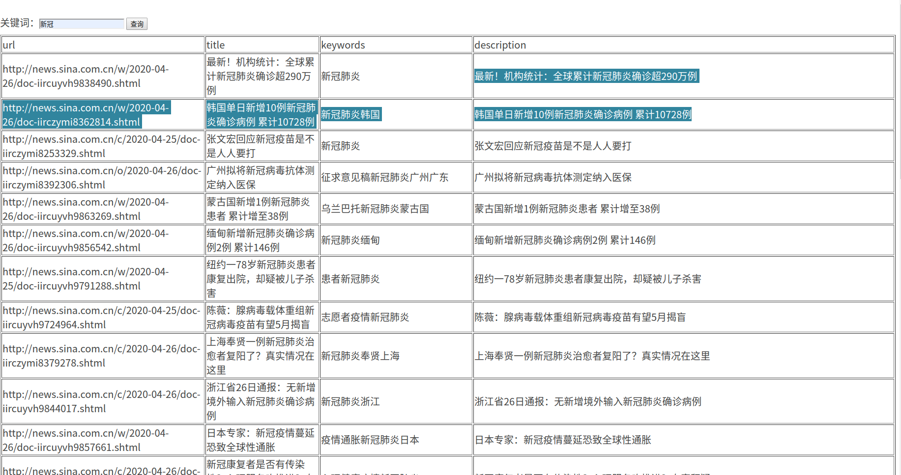

核心需求：

1. 选取3-5个代表性的新闻网站（比如新浪新闻、网易新闻等，或者某个垂直领域权威性的网站比如经济领域的雪球财经、东方财富等，或者体育领域的腾讯体育、虎扑体育等等）建立爬虫，针对不同网站的新闻页面进行分析，爬取出编码、标题、作者、时间、关键词、摘要、内容、来源等结构化信息，存储在数据库中。
2. 建立网站提供对爬取内容的分项全文搜索，给出所查关键词的时间热度分析。

技术要求：

1. 必须采用Node.JS实现网络爬虫

2. 必须采用Node.JS实现查询网站后端，HTML+JS实现前端（尽量不要使用任何前后端框架）

 代码仓库: https://github.com/ya-hong/crawler

# 开发过程

~~其实主要还是抄代码~~

列一下遇到的坑或者感觉重要的部分。

## js 的异步特性

js代码不是顺序执行的算是我遇到的第一个坑了。之前只会写c++，感觉程序顺序执行是天经地义的事情。调试的时候我发现有点不对劲，怎么程序输出顺序是反着的🤮。

然后我了解了一下异步机制：https://blog.csdn.net/qq_22855325/article/details/72958345

>  异步运行机制大致如下
>
> 1. 所有同步任务都在主线程上执行，形成一个执行栈
> 2. 主线程之外，还存在一个"任务队列"。只要异步任务有了运行结果，就在"任务队列"之中放置一个事件
> 3. 一旦"执行栈"中的所有同步任务执行完毕，系统就会读取"任务队列"，看看里面有哪些事件。那些对应的异步任务，于是结束等待状态，进入执行栈，开始执行。
> 4. 主线程不断重复上面的第三步。

举个例子：

```javascript
console.log("start");
for (i = 1; i <= 10; ++i) {
    setTimeout(function() {
        console.log("sleep " + i);
    }, 1000);
}
setTimeout(function(){
    console.log("sleep1000");
},1000);
console.log("end");

```

输出：

```
start
end
(这里-1s)
sleep 11
sleep 11
sleep 11
sleep 11
sleep 11
sleep 11
sleep 11
sleep 11
sleep 11
sleep 11
sleep1000
```

我的理解是，先执行了`console.log("start")`。然后执行十次`setTimeout`函数，把`callback`丢进队列并开始计时。再执行一次`setTimeout`函数，把`callback`丢进队列并开始计时。执行`console.log("end")`。然后等待1s所有计时全部结束，且此时i=11, 执行所有的`console.log`函数。整个过程用时大概1s。

这里就体现了javascript的优势，虽然他只有一个线程执行代码，但是它还有其他线程来执行其他任务，用异步的方式可以在进行耗时任务时执行其他代码。如果这段代码用c++写就肯定要等上11s了。

## 回调函数

JS的函数貌似和其他数据类型没有区别，也可以作为参数传递。用回调函数的方式可以使部分的异步函数按顺序执行。 

## eval() 函数

一个很强大的函数，`eval(s)` 可以把s当作代码执行。虽然它好像有效率低，不安全的缺点，但是在爬虫实验里我觉得这个函数使封装代码变得很方便。

## request 的使用

用来拿到网页源码。

## cheerio 的使用

用cheerio加载网站种子页面，可以方便的搜索出新闻链接。加载新闻页面也可以方便我们查找其中的各种元素。

一些用法：

+   加载网页

    ```javascript
    var $ = myCheerio.load(html, { decodeEntities: true });
    ```

+   查找标签（例如meta标签）

    ```javascript
    $('meta');
    ```

+   查找某个属性的标签

    ```javascript
    $('meta[name="keyword"]');
    ```

+   查找标签下的标签（例如div标签下的a标签）

    ```javascript
    $('div a');
    ```

    查找div下为a的子标签

    ```javascript
    $('div>a');
    ```

+   查找某属性值（例如name属性为keywords的meta标签的content属性的属性值）

    ```javascript
    $('meta[name="keywords"]').eq(0).attr("content");
    ```

+   整合文本信息

    ```javascript
    $('div[class="article"]').text();
    ```


## mysql 数据库的使用

其实我第一天就爬了一些数据了，但是不知道怎么搜索。查到elasticsearch可以实现搜索但是一直没搞明白怎么用，就一直搁置了。

本来我是按照标题存成一个个文件的（https://github.com/ya-hong/crawler/blob/master/del/baidunews.js），但是把数据保存到数据库里有很多好处。是直接解决了搜索的问题，而且是查询编码、标题、作者、时间、关键词、摘要、内容、来源等信息比在文件中重新查找要方便且高效。

在代码中连接数据库要用到mysql包。主要用到的函数：

```javascript
var pool = mysql.createPool({
    host: '127.0.0.1',
    user: '',
    password: '',
    database: ''
});
pool.getConnection(function(err, conn) {//连接
    if (err) {
        //错误处理
    }
    else {
    	conn.query(sql, sqlparam,function(qerr, vals, fields) {//sql 为数据库命令,sqlparam为参数
        	conn.release();
        });
    }
}
```

代码：https://github.com/ya-hong/crawler/blob/master/mysql.js

## 正则表达式

在种子页面上用cheerio找到的链接可能会包含非新闻页面的链接。如果能找到新闻页面和非新闻页面链接的区别，可以用正则表达式将它们区分开来。

一开始看到有点头大，但是实际上网页链接中只有字母、数字、冒号和斜杠。连空格和换行都没有，这样实际上用不到太多语法。

正则描述了一种字符串匹配的模式。列一下我用到的语法：

|字符 | 含义|
| ------ | -------------------- |
|      \  |  转义             |
| .      | 匹配一个非换行字符   |
| {n, m} | 匹配前一个子表达式n到m次 |
|   {n, }       |匹配前一个子表达式至少n次                             |
| *      | 等价于{0,}           |
| ^      | 匹配输入字符串的开始位置                  |
| $      |            匹配输入字符串的结束位置          |
| (str)     |   匹配str，且str为一个子表达式                   |
| [a-z]  |     匹配'a'-'z'的一个字母                 |
| [0,9]  |            匹配'0'-'9'的一个数字          |

一个测试正则表达式的网站：http://c.runoob.com/front-end/854

js中的正则表达式要写在`/       /` 中，例如：

```javascript
url_reg = /\/\/www\.sohu\.com\/a\/.*/
```

可以匹配

```
//www.sohu.com/a/391299036_114988?spm=smpc.news-home.top-news2.1.1587894845483yLbRjQ5

//www.sohu.com/a/391306114_115362?spm=smpc.news-home.top-news3.2.1587894845483yLbRjQ5

//www.sohu.com/a/391335217_161795?spm=smpc.news-home.top-news3.4.1587894845483yLbRjQ5
```


## express 框架

说好尽量不使用任何框架，但是我还是不太会怎么写html代码。html连接数据库就不会了，还是要抄老师代码-_-||。

`express -e search_site` 生成一个search_site文件夹，将[mysql.js](https://github.com/ya-hong/crawler/blob/master/mysql.js)拷贝进文件夹，再修改[`search_site/routes/index.js`](https://github.com/ya-hong/crawler/blob/master/search_site/routes/index.js) ,把[search.html](https://github.com/ya-hong/crawler/blob/master/search_site/public/search.html)拷贝进public文件夹，我们就抄完了代码。

用node运行`search_site/bin/www`就可以访问`localhost:3000/search.html`来搜索了。


# 代码实现

## 最初的代码

https://github.com/ya-hong/crawler/blob/master/del/baidunews.js

因为被异步搞懵了，我这里的callback完全是乱写的。

基本就是简单的用request获取html，再用cheerio查找标题、链接和正文，然后写入文件。

## 稍微改进一点

https://github.com/ya-hong/crawler/blob/master/del/xinglang.js

这次多检索了几个关键词。但是由于我不会搜索，后面就不想改进了。

## 老师的代码

https://github.com/ya-hong/crawler/tree/master/teachersCode

后面的基本就在老师的模板上改动了。

## 比较成熟的代码

做了一些微小的工作。

### 链接的获取

老师给出的代码基本就是如果能用正则表达式匹配到东西，那么就把这个链接算作又用的链接

```javascript
var href = "";
href = $(e).attr("href");
if (href == undefined) return;
if (href.toLowerCase().indexOf('http://') >= 0) myURL = href; //http://开头的
else if (href.startsWith('//')) myURL = 'http:' + href; ////开头的
else myURL = seedURL.substr(0, seedURL.lastIndexOf('/') + 1) + href; //其他
```

我在写爬虫的时候发现有时候href里会有两个链接连在一起的情况。 比如`https://news.sina.com.cn/https://news.sina.com.cn/c/2020-04-26/doc-iirczymi8398853.shtml`，我不知道怎么解决。

所以我就直接从`//`匹配到了结尾：

```javascript
var href = "";
href = $(e).attr("href");
if (href == undefined) return;
if (!format.url_reg.test(href)) return;
myURL = "http:"+format.url_reg.exec(href)[0];
```

其中

```javascript
format.url_reg=/\/\/news.sina.com.cn\/[a-z]\/.*\.shtml/
```

这样既解决了链接粘在一起的问题，又不需要判断这个链接到底是http开头、https开头还是//开头了。

### 用表格显示搜索结果

好像有要求用表格显示搜索结果。虽然老师的代码已经用表格显示了，但是没有框看着难受。

在`search/public/search.html`里的`<table>`标签加一个`<border>`属性就好了。

```javascript
<table width="100%" id="record2" border="1"></table>
```


然后就发现了原来代码的一个小错误：


后面全都多了一个单元格

```html
for (let list of data) {
	let table = '<tr class="cardLayout"><td>';
	Object.values(list).forEach(element => {
		table += (element + '</td><td>');
	});
	$("#record2").append(table + '</td></tr>');
}
```

修改了一下

```html
for (let list of data) {
	let table = '<tr class="cardLayout">';
	Object.values(list).forEach(element => {
		table += ('<td>' + element + '</td>');
	});
	$("#record2").append(table + '</tr>');
}
```

但是还爬了很多数据都没有用上，心里感觉不爽。

于是我把表头改称了url，title, keywords, description。 虽然用到的数据实际上变少了，但是感觉合理了一些。

然后routes也要同步的修改。该为询问与表头相关的四个部分：

```javascript
router.get('/process_get', function(request, response) {
    //sql字符串和参数
    var fetchSql = "select url,title,keywords,description " +
        "from fetches where title like '%" + request.query.title + "%'";
    mysql.query(fetchSql, function(err, result, fields) {
        response.writeHead(200, {
            "Content-Type": "application/json"
        });
        response.write(JSON.stringify(result));
        response.end();
    });
});
```

感觉只从标题搜索结果太少了，我就同时从标题和内容搜索了：

```javascript
router.get('/process_get', function(request, response) {
    //sql字符串和参数
    var fetchSql = "select url,title,keywords,description " +
        "from fetches where title like '%" + request.query.title + "%' or content like '%" + request.query.title + "%'";
    mysql.query(fetchSql, function(err, result, fields) {
        response.writeHead(200, {
            "Content-Type": "application/json"
        });
        response.write(JSON.stringify(result));
        response.end();
    });
});
```


最后我把css改称了自己跟博客的一样的[css](https://github.com/ya-hong/crawler/tree/master/search_site/public/css)。

```html
<header>
    <script src="https://cdn.bootcss.com/jquery/3.4.1/jquery.js"></script>
    <link rel="stylesheet" type="text/css" href="./css/clean-blog.min.css">
</header>
```

不过只有字体和复制的颜色有比较明显的变化。

### 代码的封装

这个其实一开始就该做了。我调试完第一个网站的代码后，把它复制了一遍来写第二个网站的代码。等我发现代码有问题的时候就已经要改两份代码了，瞬间觉得自己是nt。

还好问题发现的早，不然就要调三四份了。

由于用了`eval()`所以还是很容易抽出不同网站爬虫的相同代码的。

原来的代码：https://github.com/ya-hong/crawler/blob/master/teachersCode/crawler2.js

显然`request`,`seedget`,`newsGet` 这三个函数对每个网站都是一样的。可以写一个[crawls.js](https://github.com/ya-hong/crawler/blob/master/crawler.js)把他们写到一起。

然后每份爬虫代码都把source_name, title_format, url_reg 这些变量打包传递给crawls.js。这样每个爬虫代码都很短，而且crawls.js每次要修改的时候也不需要在多个代码里修改了。

```javascript
var crawler = require('./crawler');
var format = {
    source_name : "中国新闻网",
    myEncoding : "utf-8",
    seedURL : 'http://www.chinanews.com/',
    seedURL_format : "$('a')",
    keywords_format : " $('meta[name=\"keywords\"]').eq(0).attr(\"content\")",
    title_format : "$('title').text()",
    date_format : "$('#pubtime_baidu').text()",
    author_format : "$('#editor_baidu').text()",
    content_format : "$('.left_zw').text()",
    desc_format : " $('meta[name=\"description\"]').eq(0).attr(\"content\")",
    source_format : "$('#source_baidu').text()",
    url_reg : /^\/\/www\.chinanews\.com\/.*\/(\d{4})\/(\d{2})-(\d{2})\/(\d{7}).shtml$/,
    regExp : /((\d{4}|\d{2})(\-|\/|\.)\d{1,2}\3\d{1,2})|(\d{4}年\d{1,2}月\d{1,2}日)/
};
crawler.seedget(format);
```


### 一些细节

+   一些特判

    不管怎么判断，光凭url还是不能确定这个页面一定是新闻页面。而且即使是新闻页面也有可能出现不一样的格式。所以可能会读不到date，如果读不到date直接进行后续操作就会报错，所以必须判断它有没有读取到。

+   输出顺序

    js的输出可能不会按自己想象的来，也是异步特性的弊端吧。即使我已经知道了js是异步的，看到console的输出还是懵了。感觉这个特性给debug带来极大困难。

+   之前的代码并不能保证不写入重复的url

    如果在种子页面上读取了同一个url两次，就可能会写入重复的url。由于异步特性，js先对所有url判断数据库中是否有相同url，然后再将所有url写入，导致了重复。这其实问题不大，但是一开始看到我还以为mysql出问题了。

# 成果展示



其实还是很简陋，只有复制颜色稍微漂亮了一点。

不够修改了一下搜索，起码结果变多了。

# 学习体会

（施工中）

膜法时间

感觉自己还是too young too simple, sometimes naive， 知识水平还不够，只能抄老师代码。感觉这次实验，自己写的代码和老师写的代码只有三七开吧。但是也不能过于神话老师的代码，要辨证的看待。早期确实依赖老师的代码来写爬虫，但是最终还是要尽量用自己的代码的。

